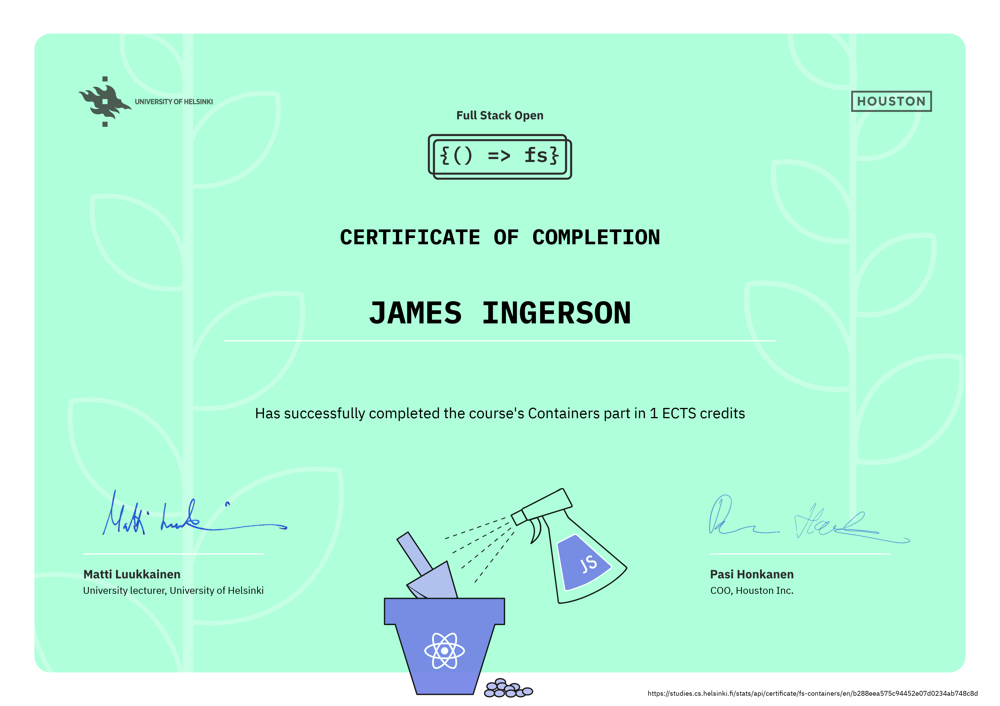

# [Full Stack Open 2022](https://fullstackopen.com/en/)

Learning React, Redux, Node.js, MongoDB, GraphQL, TypeScript, React Native, GitHub Actions, Docker, and PostgreSQL.

## [Part 12 - Containers](https://fullstackopen.com/en/part12)

a. [Introduction to Containers](https://fullstackopen.com/en/part12/introduction_to_containers)  
b. [Building and configuring environments](https://fullstackopen.com/en/part12/building_and_configuring_environments)  
c. [Basics of Orchestration](https://fullstackopen.com/en/part12/basics_of_orchestration)

## Module Certificate

  

